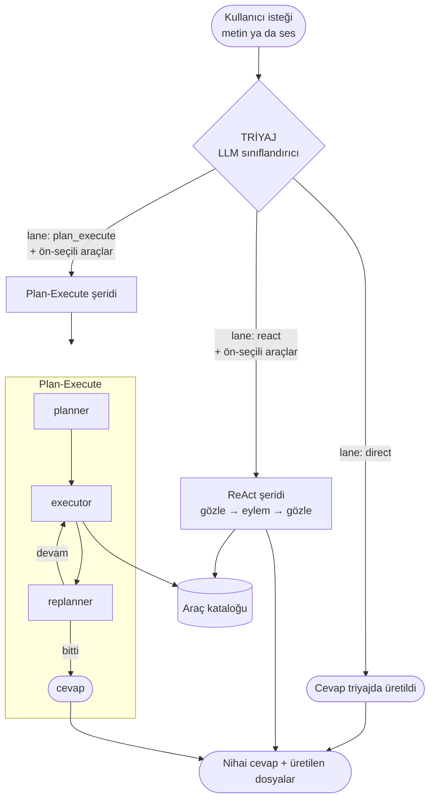

# AgentArdil

Triyaj tabanlı **hibrit agent sistemi**: gelen her isteği önce sınıflandırıp üç
yürütme şeridinden en uygununa yönlendirir — böylece basit sorular anında cevaplanır,
karmaşık işler ise gereken kadar akıl yürütmeyle çözülür. Sesle konuşarak da
kullanılabilir, çok alanlı bir araç setine sahiptir ve her koşunun ne yaptığını
adım adım loglar.

- **Backend:** Python · LangGraph · FastAPI
- **Frontend:** React 19 · Vite
- **LLM:** sağlayıcı-bağımsız (OpenAI-uyumlu endpoint; varsayılan `gpt-4.1`)
- **Ses tanıma (STT):** Yerel, Qwen3-ASR-1.7B (mikrofon → WebSocket → metin, GPU/CUDA)
- **Sesli çıktı (TTS):** Fish Audio S2-Pro — cloud API, Türkçe destekli (opsiyonel)

---

## İçindekiler

- [Neden hibrit?](#neden-hibrit)
- [Mimari](#mimari)
- [Dizin yapısı](#dizin-yapısı)
- [Kurulum](#kurulum)
- [Çalıştırma](#çalıştırma)
- [Nasıl çalışır?](#nasıl-çalışır)
- [Loglama ve gözlemlenebilirlik](#loglama-ve-gözlemlenebilirlik)
- [Ses tanıma (STT)](#ses-tanıma-stt)
- [Sesli çıktı (TTS)](#sesli-çıktı-tts)
- [Model karşılaştırması (legacy vs güncel)](#model-karşılaştırması-legacy-vs-güncel)
- [Ortam değişkenleri](#ortam-değişkenleri)
- [Tasarım kararları](#tasarım-kararları)

---

## Neden hibrit?

Tek tip bir agent her işi aynı yöntemle çözmeye çalışır: "nasılsın" sorusuna bile
plan kurar, ya da çok adımlı bir işi tek hamlede halletmeye çalışıp yarıda kalır.
AgentArdil bunun yerine önce **triyaj** yapar ve işi yapısına göre yönlendirir:

| Şerit | Ne zaman | Nasıl çalışır |
|-------|----------|----------------|
| **direct** | Araç gerektirmeyen sohbet/tanım soruları | Triyaj cevabı **aynı yanıtta** üretir (ekstra tur yok) |
| **react** | Araç gerekiyor ama yol baştan belli değil, ya da iş kısa | Her turda gözleme bakarak sonraki eylemi seçer |
| **plan_execute** | Çok adımlı, adımları baştan çıkarılabilen işler | Önce tam plan, sonra sırayla yürütme, gerekirse yeniden planlama |

Ayrım işin **konusuyla değil yapısıyla** ilgilidir: "Adımları şimdiden yazabiliyor
muyum?" sorusu şeridi belirler.

---

## Mimari



Triyaj **zengin** bir karar döndürür: sadece şeridi değil, o iş için **ön-seçilmiş
araç alt kümesini** de. Böylece alt katmanlar 20+ aracın tamamını değil, yalnızca
gerekebilecek 2-3 aracı görür — context küçülür, yanlış araç seçme ihtimali düşer.

Her şerit dışarıya **aynı arayüzü** sunar (`{input, history}` alır,
`{response, tool_calls, artifacts}` döner); bu yüzden triyaj katmanı şeritlerin
içini bilmek zorunda değildir.

---

## Dizin yapısı

```
AgentArdil/
├── run_api.py              # API sunucusunu başlatır (uvicorn)
├── main.py                 # CLI: şeritleri/triyajı terminalden çalıştır
├── pyproject.toml
├── requirements.txt        # tüm bağımlılıklar (sonda opsiyonel STT/TTS bölümleri)
├── .env.example            # ortam değişkenleri şablonu
│
├── src/agent_core/
│   ├── router.py           # Sistemin tek giriş kapısı: triyaj + şeritler
│   ├── config.py           # Sağlayıcı-bağımsız LLM kurulumu (.env'den)
│   ├── tools.py            # Araç registry'si + LangChain köprüsü
│   ├── history.py          # Session (sohbet) hafızası
│   ├── messages.py         # Mesajlardan araç çağrısı/dosya çıkarımı (ortak)
│   ├── tracing.py          # Koşu izleme → session log dosyaları
│   ├── stt_stream.py       # Ses tanıma: Qwen3-ASR-1.7B, WebSocket /ws/stt (yerel)
│   ├── tts.py              # Sesli çıktı: metni parçalayıp Fish Audio S2-Pro ile seslendirir (cloud)
│   ├── api.py              # FastAPI: frontend'in konuştuğu HTTP arayüzü
│   │
│   ├── triage/             # Yönlendirme katmanı (schemas/prompts/nodes)
│   ├── plan_execute/       # Plan-Execute şeridi (+ kısa süreli hafıza)
│   └── react/              # ReAct şeridi
│
└── Frontend/               # React 19 + Vite sohbet arayüzü
    ├── src/api.js          # Backend istemcisi
    └── src/components/      # Sidebar, ChatHeader, ChatMessage, ChatInput
```

---

## Kurulum

### Gereksinimler
- Python ≥ 3.11
- Node.js ≥ 18
- [`uv`](https://github.com/astral-sh/uv) (önerilir) ya da `pip`

### 1) Backend

```bash
# proje kökünde
uv venv --python 3.11
uv pip install -e .

# ortam değişkenleri
cp .env.example .env
# .env'i açıp LLM_API_KEY (ve istersen TAVILY_API_KEY) doldur
```

> **Not (Windows/OneDrive):** Proje OneDrive altındaysa `uv` komutlarını
> `--link-mode=copy` ile çalıştır (OneDrive sabit bağlantıya izin vermez):
> `uv pip install --link-mode=copy -e .`

> **Opsiyonel — sesli özellikler:** STT (Qwen3-ASR, yerel GPU/CUDA ~4 GB VRAM) ve
> TTS (Fish Audio, cloud API, ekstra paket yok) paketleri `requirements.txt`'in
> sonundaki opsiyonel bölümlerdedir. İstemiyorsan o bölümleri silebilirsin; agent
> metinle çalışmaya devam eder. Ayrıntı için [Ses tanıma](#ses-tanıma-stt) ve
> [Sesli çıktı (TTS)](#sesli-çıktı-tts) bölümlerine bak.

### 2) Frontend

```bash
cd Frontend
npm install
```

---

## Çalıştırma

Sistem **iki süreçten** oluşur (sesli çıktı ayrı bir süreç GEREKTİRMEZ — model
backend'in içinde çalışır):

| Süreç | Port | Nasıl başlar |
|-------|:----:|--------------|
| **Backend API** (uvicorn) | `8000` | `python run_api.py` |
| **Frontend** (Vite) | `5173` | `Frontend/`'de `npm run dev` |

### 1) Backend (Terminal 1 — proje kökü)

Önce venv'i aktive et (Windows cmd: `.venv\Scripts\activate`), sonra:

```bash
python run_api.py            # http://127.0.0.1:8000
# geliştirme (dosya değişince yeniden başlar):
python run_api.py --reload
```

Sesli çıktı açıksa cevap **Fish Audio'nun cloud API'siyle** seslendirilir (yerel
model yüklemesi yok). Mikrofon açıldığında Qwen3-ASR modeli **ilk sesli istekte**
aynı süreçte yüklenir (o ilk deşifre birkaç saniye bekler; sonrakiler hızlı).

### 2) Frontend (Terminal 2 — `Frontend/`)

```bash
npm run dev                  # http://localhost:5173
```

Tarayıcıda **frontend adresini** aç (`http://localhost:5173`) — backend adresini
(`:8000`) değil. Vite, `/api/*` isteklerini otomatik olarak backend'e yönlendirir
(proxy), böylece CORS derdi olmaz ve ajanın ürettiği görseller/sesler doğrudan çalışır.

> Kök adres `http://127.0.0.1:8000/` "Not Found" döndürür — bu **normaldir**, API
> `/api/*` altında yaşar. Sağlık kontrolü: `http://127.0.0.1:8000/api/health`.

### Kullanım

- Alt taraftaki giriş kutusuna yaz ya da 🎤 ile konuş: durdurunca Qwen3-ASR metni
  kutuya yazar, gözden geçirip gönderirsin (STT şu an **saf batch modda**, bkz.
  [Ses tanıma](#ses-tanıma-stt)).
- 🔊 **Sesli çıktı** anahtarını açarsan cevap Fish Audio ile seslendirilir (bkz.
  [Sesli çıktı](#sesli-çıktı-tts)).
- Dil seçici şu an **işlevsiz** (Qwen sunucu tarafında Türkçe'ye sabitlenmiş);
  arayüzde duruyor ama STT'yi etkilemiyor — bilinen bir eksik.

### CLI (backend'i tek başına denemek için)

```bash
python main.py "Apple'ın güncel fiyatı nedir?"          # triyaj karar verir
python main.py --lane react "AAPL ile MSFT'yi karşılaştır"
python main.py --lane plan_execute --tools get_balance_sheet,plot_chart "MSFT bilançosu ve grafiği"
```

---

## Nasıl çalışır?

### Triyaj
Küçük/hızlı bir LLM, isteği **structured output** ile sınıflandırır. `lane` katı
bir enum'dur (geçersiz şerit üretilemez). `direct` şeridinde cevabı da aynı yanıtta
döndürür — sohbet mesajları için ikinci bir tur beklenmez.

### Plan-Execute şeridi
`planner → executor → replanner` döngüsü. **Kısa süreli hafıza** her adımın tam
kaydını tutar: yapılan araç çağrıları, **ham çıktıları** ve üretilen dosyalar.
(Yalnızca özet saklamak, replanner'ın tamamlanmış bir adımı "yapılmamış" sanıp
yeniden planlamasına — sonsuz döngüye — yol açıyordu; ham çıktı bunu çözer.)

### ReAct şeridi
Önden plan kurmayan tek bir döngü: elindeki bilgiye bak → bir araç çağır → çıktısını
oku → sonraki eyleme karar ver. LangChain'in hazır tool-calling ajanı kullanılır.

### Araçlar
`tools.py`'daki registry'ye bir fonksiyon eklemek yeni bir yetenek kazandırır;
agent kodu değişmez. Mevcut set finans ağırlıklıdır (yfinance: fiyat, temel veriler,
rasyolar, gelir tablosu, bilanço, nakit akışı, analist, haber, teknik göstergeler,
karşılaştırma) + `calculator`, `web_search` (Tavily), `plot_chart`, `visualize_data`.
Prompt'lar **alan bağımsızdır** — yeni alanlarda araç eklendikçe prompt'lara
dokunmak gerekmez.

Her araç çağrısında zorunlu bir `reason` alanı vardır: model o aracı **neden**
seçtiğini yazar. Araç mantığına girmez, yalnızca loga (DÜŞÜNCE) geçer.

### Session hafızası
Aynı sohbetteki önceki turlar (kullanıcı mesajları + ajan cevapları) triyaja ve
şeritlere aktarılır; böylece **"onu 1 yıllık yap"** gibi devam istekleri çözülür.
Hafıza yalnızca konuşma metnidir (ara süreç/araç çıktıları girmez).

---

## Loglama ve gözlemlenebilirlik

Frontend'e yalnızca **nihai cevap** döner; ara sürecin tamamı sunucuda
`logs/sessions/<session_id>.log` dosyasına **anlık** yazılır (koşu sürerken
`tail -f` ile izlenebilir). Her koşu için:

- Triyaj kararı (şerit, alan, seçilen araçlar, gerekçe)
- Her LLM çağrısı: **girdi mesajları, çıktı, model, token (girdi/çıktı), süre**
- ReAct/Plan-Execute döngüsü: **DÜŞÜNCE → EYLEM → GÖZLEM** çerçevesiyle
- Araç çağrıları, çıktıları, üretilen dosyalar
- Özet: toplam süre, LLM çağrısı sayısı, toplam token, aşama başına dağılım

Örnek (kısaltılmış):
```
[  2,658 ms]   ┌─ DÖNGÜ 1 · gpt-4.1 · 1.54 sn · 688 token (girdi 637 / çıktı 51)
                │ DÜŞÜNCE: TSLA hakkında en güncel gelişmeleri öğrenmek istiyorum.
                │ EYLEM  : get_company_news(TSLA)
                │ GÖZLEM : get_company_news → 1.75 sn · 518 karakter
                └────────────────────────────────────────
```

---

## Ses tanıma (STT)

**Yerel**, Qwen3-ASR-1.7B (GPU/CUDA) — cloud/anahtar gerekmez.

> **Durum: SAF (batch) test modu.** Canlı interim (konuşurken kelime kelime
> belirme) GEÇİCİ OLARAK DEVRE DIŞI. Mikrofona bas → konuş → tekrar bas (durdur)
> → ses biriktirilmiş hâlde **tek seferde** Qwen3-ASR'a gönderilir → birkaç
> saniye içinde ("Metne çevriliyor…") metin giriş kutusuna yazılır. Eski
> VAD/interim tasarımı (faster-whisper + silero-VAD) git geçmişinde durur; Qwen
> daha hızlı bir motorla koşarsa ya da hibrit (interim hızlı model + final Qwen)
> istenirse geri getirilir.

Zincir:
```
🎤 → Web Audio + AudioWorklet (16kHz PCM) → WebSocket /ws/stt → FastAPI
   → ses biriktirilir → "__stop__" sinyali → Qwen3-ASR-1.7B (transformers) → final metin
   → React: giriş kutusuna yazılır
```

- **Qwen3-ASR-1.7B** ([Qwen/Qwen3-ASR-1.7B-hf](https://huggingface.co/Qwen/Qwen3-ASR-1.7B-hf)),
  `transformers>=5.13` ile native yükleniyor. ~4 GB VRAM.
- **Dil sıkı şekilde Türkçe'ye zorlanıyor:** `processor.apply_transcription_request(language=...)`
  sistem mesajına sadece dil adını (zayıf bir *ipucu*) koyuyor; bunun yerine
  `stt_stream.py` mesajı elle kurup güçlü bir talimat kullanıyor ("strictly in
  Turkish only, never switch language…") — model başka dile kaymasın diye.
- **İstemci-kapatma sırası önemli:** Starlette/FastAPI kapanmış bir WebSocket'e
  mesaj gönderemiyor; bu yüzden istemci kapatmadan önce `"__stop__"` metin
  mesajı yollar, sunucu bağlantı **hâlâ açıkken** deşifre edip cevap verir,
  sonra kapatır.
- Kod: [`stt_stream.py`](src/agent_core/stt_stream.py) + `/ws/stt` ([api.py](src/agent_core/api.py)).
- **Chrome/Edge** önerilir (16 kHz AudioContext + AudioWorklet).

Giriş kutusunun üstünde **cihaz seçici** ve **canlı seviye göstergesi** vardır.
Dil seçici arayüzde duruyor ama şu an **işlevsiz** (bilinen eksik — Qwen sunucu
tarafında Türkçe'ye sabit).

Ayarlar (`.env`, değişince sunucuyu yeniden başlat):

| Değişken | Varsayılan | Etki |
|----------|:----------:|------|
| `QWEN_ASR_MODEL` | `Qwen/Qwen3-ASR-1.7B-hf` | Model kimliği (0.6B daha küçük/hızlı alternatif) |
| `STT_STREAM_LANG_NAME` | `Turkish` | Zorlanan dil (Qwen dil ADI ister, kod değil) |
| `QWEN_ASR_SYSTEM_PROMPT` | (yukarıdaki güçlü TR talimatı) | Sistem mesajını tamamen özelleştirir |
| `QWEN_ASR_MAX_NEW_TOKENS` | `256` | Üretimde en çok token (uzun cümlelerde artır) |

> Önceki yollar (Groq Whisper batch, sonra faster-whisper+silero-VAD streaming)
> kaldırıldı; STT artık Qwen3-ASR ile yereldir.

---

## Sesli çıktı (TTS)

Metni sese çevirmek için **Fish Audio S2-Pro** (cloud API) kullanılır —
[huggingface.co/fishaudio/s2-pro](https://huggingface.co/fishaudio/s2-pro), 5B
parametreli, Türkçe dahil çok dilli, ses klonlama destekler.

> **Neden cloud, yerel değil?** S2-Pro'nun resmî gereksinimi **24 GB VRAM** —
> tüketici GPU'larına sığmaz. Fish Audio aynı modeli kendi sunucularında
> (H200 gibi) çalıştırıp API olarak sunuyor; biz yalnızca HTTP isteği atıyoruz,
> yerel GPU/torch hiç gerekmez.

Arayüzde giriş kutusunun üstündeki 🔊 **Sesli çıktı** anahtarı açıkken, ajanın
cevabı **metinle birlikte** seslendirilir. Uzun cevaplar cümle sınırında
**parçalanır** ve arayüz parçaları **sırayla oynatır** — biri biterken diğeri
hazırdır (aşamalı oynatma; kullanıcı ▶'ye basınca başlar).

```
Frontend (🔊)  ──►  API :8000  ──►  tts.py (parçala → Fish Audio API → wav)
      ▲                                        │
      └────────  wav parçaları (sırayla oynatılır)  ◄────┘
```

### Kurulum

```bash
uv pip install fish-audio-sdk    # tek, hafif bağımlılık — GPU/torch gerekmez
```

**Zorunlu:** `.env`'e `FISH_AUDIO_API_KEY` (bkz. [fish.audio/app/developers](https://fish.audio/app/developers)).

> **Dikkat — iki ayrı bakiye:** Fish Audio'da *platform kredisi* ile *API kredisi*
> AYRI cüzdanlardır. Hesabına genel kredi/ödeme eklemek API çağrılarını
> çalıştırmaz; API kredisini **ayrıca**, developers sayfasından yüklemen gerekir
> (aksi halde `402 Payment Required` alırsın).

### Ses ayarları

`.env`'den (değişince sunucuyu yeniden başlat):

| Değişken | Varsayılan | Etki |
|----------|:----------:|------|
| `FISH_AUDIO_API_KEY` | — | **Zorunlu.** API anahtarı |
| `FISH_BACKEND` | `s2-pro` | Model: `s2-pro` \| `s1` \| `s1-mini` \| `speech-1.6` \| `speech-1.5` \| `agent-x0` |
| `FISH_REFERENCE_ID` | — | Fish Audio platformunda oluşturulmuş bir ses modeli (klonlama) |
| `FISH_TOP_P` / `FISH_TEMPERATURE` | `0.7` / `0.7` | Örnekleme ayarları |
| `TTS_CHUNK_TOKENS` / `TTS_MAX_CHUNKS` | `120` / `24` | Parçalama (aşamalı oynatma) |

Dil **ayrı bir parametre değildir** — Fish, metnin dilini kendisi tespit eder
(Türkçe metin Türkçe seslendirilir). Parça-sınırı klik/sessizliği için her
parçaya hafif **baş/son sessizlik kırpma + fade in/out** uygulanır
(`TTS_FADE_MS`, `TTS_TRIM_SILENCE`, aynı XTTS-dönemindeki mantık).

> **Lisans:** Fish Audio Research License — araştırma/ticari-olmayan kullanım
> ücretsiz serbest; ticari kullanım için ayrı lisans gerekir (business@fish.audio).

> Önceki yerel yollar (Chatterbox, sonra XTTS-v2) kaldırıldı; TTS artık Fish
> Audio cloud API'siyle çalışıyor.

---

## Model karşılaştırması (legacy vs güncel)

Güncel yığın (Qwen3-ASR + Fish Audio) benimsenmeden önce, **eski yığınla
(Groq whisper-large-v3 + XTTS-v2) yan yana A/B testi** yapılabilmesi için bir
karşılaştırma ortamı kuruldu. İki sistem **eş zamanlı, farklı portlarda** çalışır:

| | Legacy | Güncel |
|---|---|---|
| **STT** | Groq whisper-large-v3 (cloud, batch) | Qwen3-ASR-1.7B (yerel, batch) |
| **TTS** | XTTS-v2 (yerel, GPU) | Fish Audio S2-Pro (cloud) |
| **Frontend** | `:5173` | `:5174` |
| **Backend** | `:8001` | `:8000` |
| **Konum** | `../AgentArdil-legacy` ([git worktree](https://git-scm.com/docs/git-worktree), commit `759177b`'de) | bu repo (`main`) |

### Kurulum (legacy worktree)

```bash
# proje kökünün YANINA, ayrı bir çalışma dizini olarak
git worktree add ../AgentArdil-legacy 759177b   # XTTS+Groq'un birlikte olduğu commit
cd ../AgentArdil-legacy
uv venv .venv --python 3.11
uv pip install --link-mode=copy --index-strategy unsafe-best-match -r requirements.txt
cd Frontend && npm install
```

`../AgentArdil-legacy/.env` ayrı bir dosyadır (ana `.env`'den `LLM_*`/`GROQ_API_KEY`/
`TAVILY_API_KEY` kopyalanır) ve `Frontend/vite.config.js`'i `:8001`'e, portu
`5173`'e sabitleyecek şekilde düzenlenir (bkz. worktree'deki yerel değişiklikler).

### Çalıştırma

```bash
# Terminal 1 — legacy backend
cd ../AgentArdil-legacy && .venv/Scripts/python run_api.py --port 8001
# Terminal 2 — legacy frontend
cd ../AgentArdil-legacy/Frontend && npm run dev        # :5173
# Terminal 3 — güncel backend (bu repo)
python run_api.py                                       # :8000
# Terminal 4 — güncel frontend (bu repo)
cd Frontend && npm run dev -- --port 5174
```

> **6 GB VRAM'de ikisi TAM GPU'lu aynı anda sığmaz.** Qwen3-ASR (~4 GB) + XTTS
> (~2 GB) üst üste bindiğinde `device_map="auto"` Qwen'in bir kısmını CPU'ya
> ("meta device") taşıyor ve deşifre bozuluyor (metin dönmüyor). Legacy backend'de
> `TTS_DISABLED=1` (`.env`) ile XTTS'i tamamen kapatıp yalnızca Groq STT'yi (cloud,
> VRAM'siz) aktif tutmak, güncel backend'in Qwen'ini rahat bırakır — iki backend
> böyle güvenle eş zamanlı çalışır.

### Karşılaştırma sırasında bulunan/düzeltilen sorunlar

- **Ortak Türkçe normalizasyon modülü** ([`tr_normalize.py`](tr_normalize.py)):
  Her iki sistem de sesi API'ye/modele göndermeden önce aynı modülden geçiriyor
  (rakam→yazı, tarih/saat, yüzde/para birimi, birim, kısaltma, akronim/marka
  telaffuzu). XTTS ve Fish Audio'nun kendi dahili normalizasyonları eksik/tutarsız
  olduğu için (ör. Fish rakamları bazen İspanyolca okuyordu) bu katman motordan
  bağımsız tutuldu — motor değişse de aynen çalışır. `ROE`, `F/K`, `PD/DD` gibi
  finans terimleri için ayrıca eklendi (oran kısaltmaları `/` → **"bölü"** diye
  okunacak şekilde genelleştirildi).
- **XTTS'in Türkçe karakter sınırı:** XTTS'in kaynağında (`tokenizer.py`)
  dil başına sabit bir iç sınır var (Türkçe = **226 karakter**); aşan girdilerde
  XTTS kendi içinde (daha az kontrollü) yeniden bölüyor — cümleler arası
  tempo/prozodi **sapmasının** asıl sebebi buydu. Legacy'nin parçalaması token
  yerine **karaktere** çevrildi (200 karakter güvenlik payı, tek cümle bile
  aşarsa kelime sınırında zorla bölünür) — uyarı ve sapma kayboldu.
- **VRAM çakışması:** Yukarıda anlatıldığı gibi `TTS_DISABLED` kilidiyle çözüldü.

Hangi yığının **sesi/doğruluğu** daha iyi verdiği kullanıcı testine bağlı (bu
repo bir karar dayatmaz); yukarıdaki bulgular yalnızca altyapı/mühendislik
düzeltmeleridir.

---

## Ortam değişkenleri

Tümü `.env`'de (bkz. [`.env.example`](.env.example)):

| Değişken | Zorunlu | Açıklama |
|----------|:-------:|----------|
| `LLM_API_KEY` | ✅ | Ana model API anahtarı |
| `LLM_MODEL` | ✅ | Model adı (ör. `gpt-4.1`) |
| `LLM_BASE_URL` | ✅* | OpenAI-uyumlu endpoint (*varsayılan OpenAI ise gerekmez) |
| `TAVILY_API_KEY` | — | `web_search` aracı için |
| `TRIAGE_MODEL` | — | Triyaj için ayrı/daha hızlı model (boşsa ana model) |
| `LLM_STRUCTURED_METHOD` | — | Sağlayıcı `json_schema` desteklemiyorsa `function_calling` |
| `QWEN_ASR_MODEL` | — | STT modeli (varsayılan `Qwen/Qwen3-ASR-1.7B-hf`) |
| `FISH_AUDIO_API_KEY` | ✅** | Sesli çıktı (TTS) için (**yalnızca 🔊 modu kullanılırsa) |

> STT (canlı) ve TTS knob'larının tamamı için bkz. [Ses tanıma](#ses-tanıma-stt),
> [Sesli çıktı (TTS)](#sesli-çıktı-tts) ve `.env.example`.

---

## Tasarım kararları

- **Yanlış triyaj için telafi/fallback mekanizması yok** (bilinçli): karar netliği
  ve sadelik önceliklidir. Şeritler arası eskalasyon yoktur.
- **Triyaj cömert araç seçer:** eksik kalan bir aracı alt katman göremeyeceği için,
  gerekebilecek araçlar da listeye eklenir; zamanla loglara bakılarak daraltılır.
- **Session/mesajlar bellekte tutulur** — sunucu yeniden başlayınca sıfırlanır
  (kalıcılık henüz eklenmedi).
- **Prompt'lar alan bağımsızdır:** hiçbir prompt belirli bir araç adına ya da alana
  (finans vb.) demirlenmez; model kararı çalışma anındaki araç kataloğuna bakarak verir.

---

